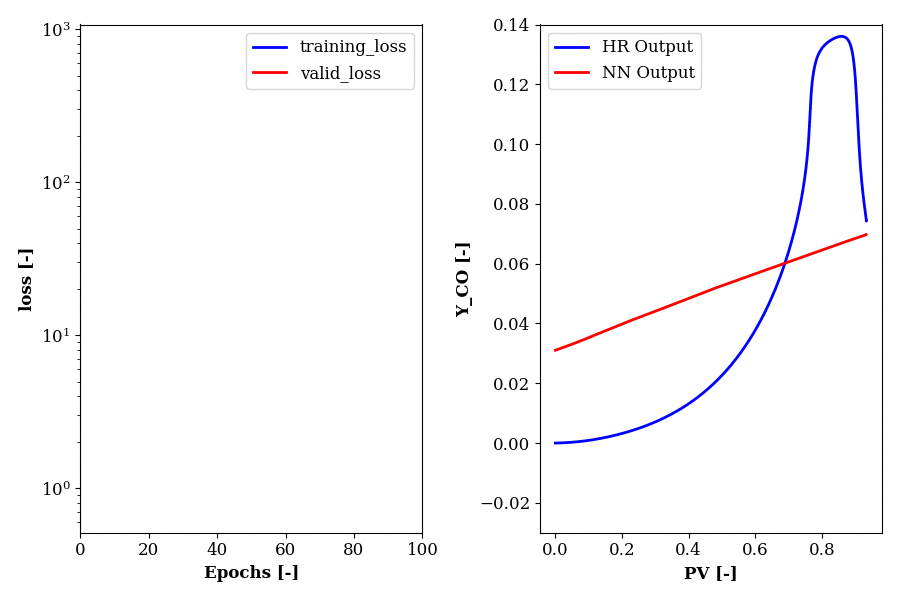

Data-driven modeling of self-ignition properties of the renewable fuel PODE (Polyoxymethylen Dimethyl ether) using methods of machine learning 
==============================================================================================================================================

Bachelor Thesis by Pascal Roth [Mail](mailto:roth.pascal@outlook.de)

Supervisors: 
- Prof. Dr. Christan Hasse, STFS, TU Darmstadt [Mail](mailto:hasse@stfs.tu-darmstadt.de)
- Julian Bissantz, STFS, TU Darmstadt [Mail](mailto:bissantz@stfs.tu-darmstadt.de)
- Philip Haspel, STFS, TU Darmstadt [Mail](mailto:haspel@stfs.tu-darmstadt.de)

Abstract
--------

Polyoxymethylene dimethyl ether (PODE) is a renewable fuel and a promising ad-
ditive for diesel engines, owing a high cetane number and the capability to reduce
soot emissions. The performance of the engine development using this alternative
fuel is highly dependent on the possibility of three-dimensional computational fluid
dynamics (CFD) engine simulations. However, using the direct chemistry approach
with detailed chemical mechanisms, increases the computational effort to an extent
where effective simulations are not feasible. In this thesis, a model is derived that
employs artificial neural networks to model the detailed chemistry in the simulation
while reducing the computational costs. As neural networks, multi-layer perceptrons
(MLPs) are selected.

The MLP models learn the intended thermochemical properties for a representation of
the entire thermochemical state-space and are able to interpolate states not covered
in the representation. Therefore, the thermochemical states are precomputed by
simulating the auto-ignition of an initialized P ODE/air mixture and discretizing the
results. Auto-ignition simulations are performed in a zero-dimensional homogeneous
reactor (HR) model and use the detailed mechanism of Cai et al. [13]. In order to
reduce complexity and optimize accuracy, the thermochemical properties are grouped
according to their temporal evolution within combustion. Four regimes have been
identified and for each one, a separate MLP model is constructed and trained. Training
is performed by applying the backpropagation algorithm, rectifier activation function
and mean squared error loss function. Look-up variables, including reaction progress
variable, mixture fraction and absolute enthalpy, are introduced in order to characterize
the thermochemical state in the CFD simulation and function as input variables of the
MLP models.

In order to validate the derived method, the learning and interpolation capability of the
MLPs are evaluated regarding the absolute and relative deviation between predicted
curves and curves generated by the HR model. Besides, the reproduction of ignition
delays is used to evaluate model performance. Furthermore, a comparison between the
method developed in this work and the Global Reaction Mechanism by Haspel [27] is
carried out. A good agreement was achieved for all thermochemical parameters as well
as ignition delays. The non-linearities in the evolution progress have been reproduced
accurately. Thus, the derived model has the precision of the detailed mechanism for
every thermochemical parameter. Besides, the presented framework can be adjusted
for other fuels.



Code Infrastructure and used Software
-------------------------------------

| ID  | creator     | code               | location                   | decription                      | start date | end date |
|-----|-------------|--------------------|----------------------------|---------------------------------|------------|----------|
| 000 | Pascal Roth | Cantera Python API | local                      | homogenous reaction simulations | 07.04.20   | 27.08.20 |
| 001 | Pascal Roth | pyTorch            | local                      | machine learning with pyTorch   | 14.04.20   | 27.08.20 |
| 002 | Pascal Roth |                    | local                      | model comparison                | 30.07.20   | 27.08.20 |
| 003 | Pascal Roth |                    | local                      | Conda environment               | 07.04.20   | 27.08.20 |

The used conda environment to run all the scripts was exported into "003-conda_environment/environment.yml".
To replicate this exact environment run 
```bash
conda env create -f /path/to/file.yml
```

| Software | Version | Source              | commit |
|----------|---------|---------------------|--------|
| pyTorch  | 1.4     | installed via conda |        |
| Cantera  | 2.2     | installed via conda |        |
